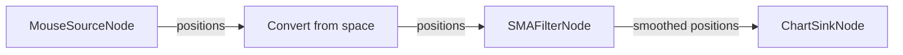

In this tutorial you will build your first positioning model with OpenHPS. You will create a source node that turns your mouse movements into positions, process them with a filter, and visualize the result on a chart. It requires nothing more than a browser and is a great way to learn the core concepts.

> **New to OpenHPS?** Make sure you have [installed @openhps/core](/docs/installation/) first, and read the [introduction](/docs/introduction/) for a quick overview of the key concepts.

The model you will build looks like this:



## 1. Creating the source node
A source node generates data frames. Our `MouseSourceNode` listens for mouse or touch movement inside a HTML element and pushes a data frame containing the position of a `DataObject` called `mouse`.

```twoslash include MouseSourceNode
// @filename: MouseSourceNode.ts
import { DataFrame, SourceNode, DataObject, Absolute2DPosition } from '@openhps/core';

export class MouseSourceNode extends SourceNode<DataFrame> {
    private elementId: string = "";
    private trackingArea: HTMLElement = undefined;

    constructor(elementId: string) {
        super();
        this.elementId = elementId;
         this.once('build', this._initMouse.bind(this));
    }
     
    _initMouse() {
        // Get tracking area
        this.trackingArea = document.getElementById(this.elementId);
        this.trackingArea.onmousemove = this.onMouseMove.bind(this);
        this.trackingArea.ontouchmove = this.onTouchMove.bind(this);
    }

    onMouseMove(e: MouseEvent) {
        const rect = this.trackingArea.getBoundingClientRect();
        const x = e.clientX - rect.left;
        const y = e.clientY - rect.top;
        this._emitPosition(x, y);
    }

    onTouchMove(e: TouchEvent) {
        if (e.touches.length > 0) {
            const rect = this.trackingArea.getBoundingClientRect();
            const touch = e.touches[0];
            const x = touch.clientX - rect.left;
            const y = touch.clientY - rect.top;
            this._emitPosition(x, y);
        }
    }

    _emitPosition(x: number, y: number) {
        const mouse = new DataObject("mouse");
        mouse.position = new Absolute2DPosition(x, y);
        const frame = new DataFrame(mouse);
        this.push(frame);
    }

    onPull(): Promise<DataFrame> {
        return new Promise((resolve) => {
            resolve(undefined);
        });
    }
}
```


```twoslash include ChartSinkNode
// @filename: ChartSinkNode.ts
import { DataFrame, SinkNode, DataObject, Absolute2DPosition, NodeData, NodeDataService } from '@openhps/core';

export class ChartSinkNode extends SinkNode<DataFrame> {
    private elementId: string = "";
    private chartCanvas: HTMLCanvasElement = undefined;
    private chart: any = undefined;

    constructor(elementId: string) {
        super();
        this.elementId = elementId;
        this.once('build', this._initChart.bind(this));
    }

    _initChart(): void {
        this.chartCanvas = document.getElementById(this.elementId) as HTMLCanvasElement;

        if (!(window as any).Chart) {
            // Load Chart.js if not loaded
            /* @ts-expect-error: Ignore dynamic import error for CDN Chart.js */
            import('https://cdn.jsdelivr.net/npm/chart.js').then(() => this._initChart());
            return;
        }
    }

    onPush(frame): Promise<void> {
        return new Promise((resolve, reject) => {
            // Store and retrieve historical data (supports multiple different object UIDs)
            const service: NodeDataService<any> = this.model.findDataService(NodeData);
            service
                // Find node specific data pertaining to "mouse"
                .findData(this.uid, frame.source)
                .then((data) => {
                    data = data ?? [];
                    data.push({ x: frame.source.position.x, y: frame.source.position.y });
                    // Store node specific data pertaining to "mouse"
                    return service.insertData(this.uid, frame.source, data);
                })
                .then((data) => {
                    // Draw chart with all X,Y locations that passed through this node
                    this.drawChart(data);
                    resolve();
                })
                .catch(reject);
        });
    }

    /**
     * Draw the chart
     * 
     * @params data Array of locations
     */
    drawChart(data: ({x: number, y: number})[]): void {
        const ctx = this.chartCanvas.getContext('2d');
        if (this.chart) this.chart.destroy();
        this.chart = new (window as any).Chart(ctx, {
            type: 'line',
            data: {
                labels: ["location"],
                datasets: [
                    {
                        label: 'Mouse Location',
                        data,
                        borderColor: '#007bff',
                        backgroundColor: 'rgba(0,123,255,0.1)',
                        fill: false,
                        showLine: true,
                        pointRadius: 2,
                        parsing: false,
                    }
                ]
            },
            options: {
                animation: false,
                scales: {
                    x: {
                        type: 'linear',
                        min: 0,
                        max: 300,
                        title: { display: true, text: 'X Position' }
                    },
                    y: {
                        type: 'linear',
                        min: 0,
                        max: 200,
                        title: { display: true, text: 'Y Position' }
                    }
                },
                plugins: {
                    legend: { display: false }
                }
            }
        });
    }
}
```

# `MouseSourceNode`
```ts twoslash
// @include: MouseSourceNode
```

The source node pushes frames that contain the `mouse` data object with its `position` set to the current X,Y coordinates.

## 2. Creating the sink node
A sink node is the final node in the model. Our `ChartSinkNode` keeps a history of all positions that passed through the node and draws them on a chart using Chart.js.

# `ChartSinkNode`
```ts twoslash
// @include: ChartSinkNode
```

The sink node stores previous positions in a `NodeDataService` so it can draw the full movement trail.

## 3. Building the model
Now we can combine everything into a positioning model using the `ModelBuilder`.

# Positioning Model

```ts twoslash
// @include: MouseSourceNode
// @include: ChartSinkNode
// ---cut---
// @filename: mouse.ts
import { ModelBuilder, DataObject, Absolute2DPosition, SMAFilterNode, ReferenceSpace, Euler, AngleUnit } from '@openhps/core';
import { MouseSourceNode } from './MouseSourceNode';
import { ChartSinkNode } from './ChartSinkNode';

const mouseReferenceSpace = new ReferenceSpace()
    .translation(0, 200)
    .rotation(new Euler(180, 0, 0, 'ZXY', AngleUnit.DEGREE));

ModelBuilder.create()
    // Step 1. Obtain X,Y location from mouse (active source node)
    .from(new MouseSourceNode("trackArea"))
    // Step 2. Flip the axis
    .convertFromSpace(mouseReferenceSpace)
    // Step 3. Simple moving average of the X,Y position (average of 40 readings)
    .via(new SMAFilterNode((obj: DataObject) => ([
            { key: "x", value: (obj.position as Absolute2DPosition).x },
            { key: "y", value: (obj.position as Absolute2DPosition).y }
        ]),
        (key: string, value: number, obj: DataObject) => { obj.position[key] = value },
        { taps: 40 })
    )
    // Step 4. Plot the results
    .to(new ChartSinkNode("mouseChart"))
    .build();
```

## Summary
- A **source node** produces data frames containing positions.
- A **reference space** transforms positions between coordinate systems.
- A **processing node** (like `SMAFilterNode`) transforms the data.
- A **sink node** consumes the final result.

You now know how to build a positioning model. Ready to take it further? Learn about [positions](/docs/position/) and [reference spaces](/docs/referencespace/) in the core concepts, or jump to the [RF fingerprinting tutorial](/docs/tutorials/fingerprinting/) to build a real indoor positioning system.