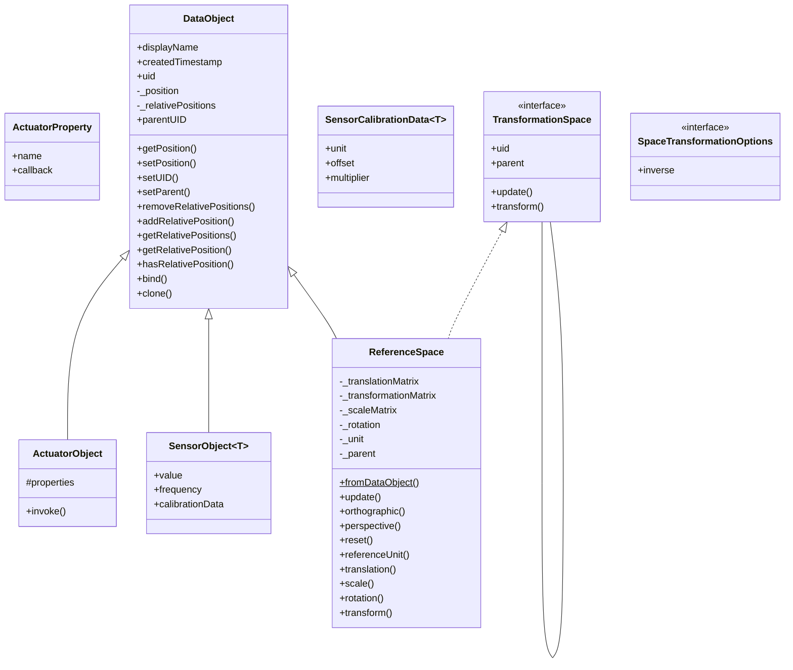
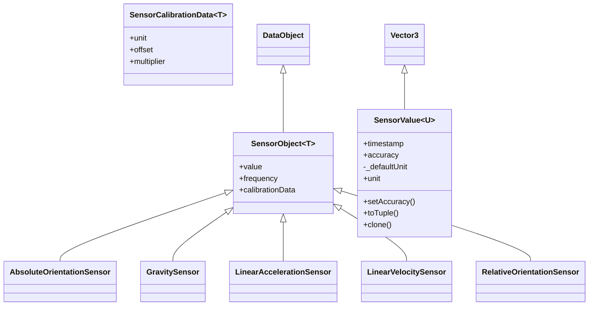

Data objects represent the object or person that you are trying to determine a position for. It can also represent
any other landmark or sensor that could have an absolute or relative position.

A data object is considered a snapshot of a the current state and should not contain any temporary information.



## Initialization
```ts twoslash
import { DataObject } from '@openhps/core';

// Create an object with unique identifier 'bsigner'
const myObject = new DataObject("bsigner", "Beat Signer");
```

A data object can be created using its constructor that takes a unique identifier and an optional display name. More information on its construction can be found in the API documentation [here](https://openhps.org/docs/core/classes/dataobject.html#constructor).

## Custom data object
Depending on what type of positioning system you are creating, you may find yourself
having to add data to data frames or data objects that do not exist yet.

An important design principle in OpenHPS is the serializability of every frame, object and data that is included in
those data types. This requires the use of decorators to indicate if data should be serialized.

```ts twoslash
// @experimentalDecorators: true
import { 
    DataObject,
    SerializableObject,
    SerializableMember
} from '@openhps/core';

@SerializableObject()
export class QRCode extends DataObject {
    @SerializableMember()
    public url: string = "";

    @SerializableMember()
    public imageBase64: string = "";
}
```

## Custom sensor object
Creating a sensor is done by extending the `SensorObject`. A sensor object takes an optional type generic to indicate the value it contains.

```ts twoslash
// @experimentalDecorators: true
import { 
    SerializableObject, 
    LuminanceIntensityUnit,
    SensorObject,
    SensorValue,
} from '@openhps/core';

@SerializableObject()
export class AmbientLightSensor extends SensorObject<SensorValue<LuminanceIntensityUnit>> {
    constructor(uid?: string, value?: SensorValue<LuminanceIntensityUnit>, frequency?: number, displayName?: string) {
        super(uid, value ?? new SensorValue(), frequency, displayName);
    }
}
```

