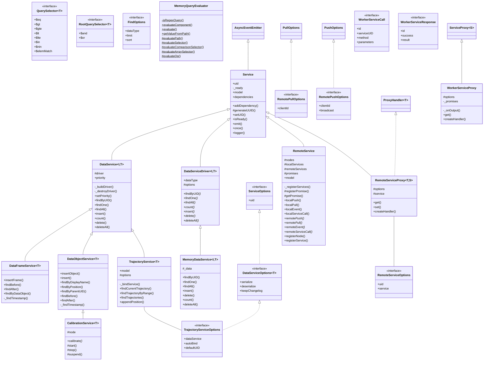

## Types of services
- ```DataServiceDriver```: A data service driver is storage interface for any data service.
- ```DataService```: A data service is meant to store serializable data. It can be accessed by any node in the model and takes a [DataServiceDriver](/docs/core/classes/DataServiceDriver.html).
    - ```DataObjectService```: A data service for handling data objects. Every positioning model includes an in-memory data object service.
    - ```DataFrameService```: A data service for handling data frames.
    - ```NodeDataService```: A data service that stores temporary node data such as intermediate processing results.
    - ```TrajectoryService```: A data service that appends the processed position of a data object to a trajectory.
- ```RemoteNodeService```: The remote node service allows the registration of [remote nodes](/docs/core/classes/remotenode.html).
- ```TimeService```: A time service can be accessed by every node to retrieve the current time. It can be used to synchronize the time with multiple systems.
- ```LocationBasedService```: A developer friendly service for pulling or watching for position changes.

## ``DataServiceDriver``
A data service driver is a database storage interface for storing any serializable object (that is any object using the ```@SerializableObject()``` decorator) with any type of identifier.

The driver should implement the following methods:
- ```findByUID(id: I): Promise<T>```: Find the data by a UID.
- ```findOne(query?: FilterQuery<T>, options?: FindOptions): Promise<T>```: Find one item based on an optional query.
- ```findAll(query?: FilterQuery<T>, options?: FindOptions): Promise<T[]>```: Find all items based on an optional query.
- ```count(query?: FilterQuery<T>): Promise<number>```: Count all items.
- ```insert(id: I, object: T): Promise<T>```: Insert a new item.
- ```delete(id: I): Promise<void>```: Delete an item.
- ```deleteAll(query?: FilterQuery<T>): Promise<void>```: Delete all items. 
The methods are similar to the [Node.js MongoDB API](https://mongodb.github.io/node-mongodb-native/4.1/classes/Collection.html) but with more limited features that would still allow other drivers other than MongoDB.

## ``LocationBasedService``
A location-based service is a developer friendly service for retrieving a location of an object.